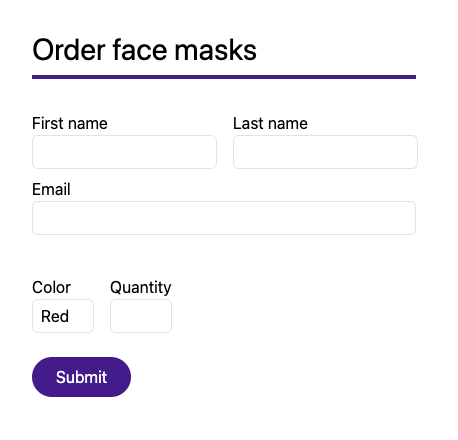
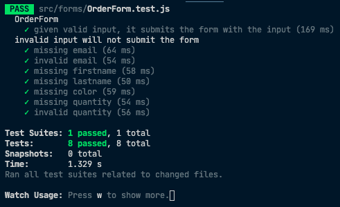

# Automatisert testing av React-komponenter

Automatiserte tester hjelper oss å sikre at kodeendringer ikke forårsaker utilsiktede endringer andre steder i kodebasen. Dette gjør det lettere å refaktorere, man sparer tid ved å bruke mindre tid på manuell testing og man kan forhindre en rekke bugs. God testdekning er med på å øke kvaliteten på kodebasen.

## Intro

Det finnes flere biblioteker som hjelper deg med å teste React-komponenter. De meste kjente er Enzyme og React Testing Library (RTL).

Hvor Enzyme lar deg inspisere state og andre implementasjonsdetaljer av en komponent, er RTL designet for å gjøre det enkelt å teste en komponent uten å måtte forholde seg til hvordan den er implementert. Dette er en god ting! I det øyeblikket testen din begynner å involvere seg i hvordan komponenten er implementert vil du oppleve at refaktorering av den samme komponenten kan få testene til å feile, selv om du ikke har endret på hvordan den fungerer for brukeren.

Vi kommer til å bruke React Testing Library her, og da får du også se at vi kan bytte ut hele implementasjonen uten å måtte gjøre noen endringer i testen!

La oss se på et eksempel.

## Skjema for bestilling av munnbind



Skjemaet er forholdsvis enkelt, men vi ønsker å sikre noen ting:

- Alle feltene er påkrevd, og man skal ikke kunne sende inn skjemaet uten å ha fylt dem ut.
- E-postadressen må være en gyldig e-postadresse.
- Munnbind er mangelvare, så vi tillater maks 5stk per kunde.

#### OrderForm.js

```jsx
import { useForm } from "react-hook-form";
import { yupResolver } from "@hookform/resolvers/yup";
import * as yup from "yup";
import { Input, Select, Option, Button } from "./FormInputs";

const schema = yup.object().shape({
  firstName: yup.string().required(),
  lastName: yup.string().required(),
  email: yup.string().email().required(),
  color: yup.string().required(),
  quantity: yup.number().min(1).max(5).required(),
});

export default function OrderForm(props) {
  const { register, handleSubmit } = useForm({ resolver: yupResolver(schema) });

  const onSubmit = (data) => {
    props.onSubmit(data);
  };

  return (
    <form
      onSubmit={handleSubmit(onSubmit)}
      className="flex flex-col space-y-10"
    >
      <div className="space-y-2">
        <div className="flex space-x-4">
          <label htmlFor="firstName" className="flex flex-col">
            First name
            <Input ref={register} type="text" id="firstName" name="firstName" />
          </label>
          <label htmlFor="lastName" className="flex flex-col">
            Last name
            <Input ref={register} type="text" id="lastName" name="lastName" />
          </label>
        </div>
        <label htmlFor="email" className="flex flex-col">
          Email
          <Input ref={register} type="text" id="email" name="email" />
        </label>
      </div>
      <div className="space-y-2">
        <div className="flex space-x-4">
          <label htmlFor="color" className="flex flex-col">
            Color
            <Select ref={register} name="color" id="color">
              <Option value="null">Select...</Option>
              <Option value="red">Red</Option>
              <Option value="blue">Blue</Option>
              <Option value="green">Green</Option>
            </Select>
          </label>
          <label htmlFor="quantity" className="flex flex-col">
            Quantity
            <Input
              ref={register}
              type="number"
              name="quantity"
              id="quantity"
              min="1"
              max="5"
            />
          </label>
        </div>
        <div className="my-6">
          <Button type="submit">Submit</Button>
        </div>
      </div>
    </form>
  );
}
```

Her tegner vi opp skjemaet ved hjelp av `react-hook-form` (og `yup` for å validere input).
Dersom man klikker på "Submit"-knappen - og alle påkrevde felter er utfylt - så kaller vi `props.onSubmit` med de utfylte dataene. Det er deretter opp til brukeren av OrderForm å definere hva som skjer videre.

### Vår første test

React Testing Library inneholder en rekke hjelpefunksjoner for å

- Rendre en komponent
- Kjøre spørringer mot DOM-en
- Interagere med komponenten - f.eks fylle ut skjemafelter, trykke på knapper osv.

La oss ta en titt på hvordan vi kan gjøre dette.

#### OrderForm.test.js

```jsx
import { screen, render, waitFor } from "@testing-library/react";
import user from "@testing-library/user-event";
import OrderForm from "./OrderForm";

describe("OrderForm", () => {
  test("given valid input, it submits the form with the input", async () => {
    const onSubmit = jest.fn();
    render(<OrderForm onSubmit={onSubmit} />);

    const firstName = screen.getByLabelText(/first name/i);
    const lastName = screen.getByLabelText(/last name/i);
    const email = screen.getByLabelText(/email/i);
    const color = screen.getByLabelText(/color/i);
    const quantity = screen.getByLabelText(/quantity/i);
    const submitButton = screen.getByText(/submit/i);

    user.type(firstName, "Bob");
    user.type(lastName, "Johnson");
    user.type(email, "bob@johnson.com");
    user.selectOptions(color, "blue");
    user.type(quantity, "5");

    user.click(submitButton);

    await waitFor(() =>
      expect(onSubmit).toHaveBeenCalledWith({
        firstName: "Bob",
        lastName: "Johnson",
        email: "bob@johnson.com",
        color: "blue",
        quantity: 5,
      })
    );
  });
});
```

1. Vi oppretter en en _mock-funksjon_ ved hjelp av `jest.fn()` og sender denne inn til OrderForm sin `onSubmit`.
   > En mock-funksjon er en funksjon som inneholder informasjon om hvor mange ganger den har blitt kalt, hvilke parametre den har blitt kalt med osv. Se https://jestjs.io/docs/en/mock-functions
2. Så bruker vi RTL's _render_-funksjon og rendrer komponenten.
3. Deretter finner vi alle skjemaelementene basert på elementenes label.
4. Vi simulerer så en utfylling av alle feltene, før vi klikker på submit-knappen.
5. Til slutt verifiserer vi at `onSubmit`-funksjonen blir kalt med dataene vi la inn.

### Hindre innsending ved ugyldig input

```jsx
  test("given invalid email, the form should not be submitted", async () => {
    const onSubmit = jest.fn();
    render(<OrderForm onSubmit={onSubmit} />);

    const firstName = screen.getByLabelText(/first name/i);
    const lastName = screen.getByLabelText(/last name/i);
    const email = screen.getByLabelText(/email/i);
    const color = screen.getByLabelText(/color/i);
    const quantity = screen.getByLabelText(/quantity/i);
    const submitButton = screen.getByText(/submit/i);

    user.type(firstName, "Bob");
    user.type(lastName, "Johnson");
    user.selectOptions(color, "blue");
    user.type(quantity, "5");
    user.type(email, "some invalid email");

    user.click(submitButton);

    await waitFor(() => expect(onSubmit).not.toHaveBeenCalled());
  });
});
```

Her sjekker vi at du ikke får sendt inn skjemaet med en ugyldig e-postadresse, selv om alle andre felter skulle være riktig utfylt.
Vi kunne duplisert denne testen for hver enkelt test case for å sikre at man ikke kan sende inn uten å ha oppgitt fornavn, etternavn, farge etc. - i stedet kan vi bruke <a href="https://github.com/atlassian/jest-in-case">jest-in-case</a> for å generere en rekke testcaser som tester det samme, bare med forskjellig input.

```jsx
import cases from "jest-in-case";

const validInput = {
  firstName: "Bob",
  lastName: "Johnson",
  email: "bob@johnson.com",
  color: "red",
  quantity: "4",
};

cases(
  "invalid input will not submit the form",
  async (opts) => {
    const onSubmit = jest.fn();
    render(<OrderForm onSubmit={onSubmit} />);

    const firstName = screen.getByLabelText(/first name/i);
    const lastName = screen.getByLabelText(/last name/i);
    const email = screen.getByLabelText(/email/i);
    const color = screen.getByLabelText(/color/i);
    const quantity = screen.getByLabelText(/quantity/i);
    const submitButton = screen.getByText(/submit/i);

    user.type(firstName, opts.firstName);
    user.type(lastName, opts.lastName);
    user.type(email, opts.email);
    user.selectOptions(color, opts.color);
    user.type(quantity, opts.quantity);
    user.type(email, "some invalid email");

    user.click(submitButton);

    await waitFor(() => expect(onSubmit).not.toHaveBeenCalled());
  },
  [
    { name: "missing email", ...validInput, email: "" },
    { name: "invalid email", ...validInput, email: "bob.com" },
    { name: "missing firstname", ...validInput, firstName: "" },
    { name: "missing lastname", ...validInput, lastName: "" },
    { name: "missing color", ...validInput, color: "" },
    { name: "missing quantity", ...validInput, quantity: "" },
    { name: "invalid quantity", ...validInput, quantity: "50" },
  ]
);
```

Vi bruker `cases` for å definere en gruppe med tester. Første parameter er navnet på gruppen. Deretter kommer selve testen, før vi sender inn en liste over de forskjellige input-verdiene vi ønsker å teste for.

Her sjekker vi altså at `onSubmit`-funksjonen ikke blir kalt for noen av tilfellene. Legg merke til hvor enkelt det er å legge inn nye sjekker dersom skjemaet skulle få nye felter en gang i fremtiden - alt du trenger å gjøre er å legge dem til i listen.



## Refaktorering

Ettersom vi kun tester det brukeren ser, og ikke bryr oss om hvordan komponenten er implementert, kan vi bytte ut hele implementasjonen av `OrderForm.js` _uten_ å måtte gjøre noen endringer i testen. Dette gir testen mye høyere verdi enn hvis vi f.eks hadde begynt å inspisere komponentens interne `state` for å validere funksjonaliteten. Testen vår bryr seg ikke om OrderForm benytter `react-hook-form`, `useState`, `useReducer` eller `Redux` til å håndtere tilstanden, og det betyr også at vi kan endre `OrderForm` uten at testen feiler. Den feiler kun dersom _funksjonaliteten_ ikke lenger er den samme.

La oss, i stedet for å bruke React Hook Form, implementere skjemaet selv.

```jsx
import { useState } from "react";
import { Input, Select, Option, Button } from "./FormInputs";

function isValidEmail(email) {
  const regex = /^(([^<>()[\]\\.,;:\s@"]+(\.[^<>()[\]\\.,;:\s@"]+)*)|(".+"))@((\[[0-9]{1,3}\.[0-9]{1,3}\.[0-9]{1,3}\.[0-9]{1,3}\])|(([a-zA-Z\-0-9]+\.)+[a-zA-Z]{2,}))$/;
  return regex.test(String(email).toLowerCase());
}

export default function OrderForm(props) {
  const [state, setState] = useState({
    firstName: { value: "", valid: false },
    lastName: { value: "", valid: false },
    email: { value: "", valid: false },
    color: { value: "red", valid: true },
    quantity: { value: "", valid: false },
  });

  const handleSubmit = (e) => {
    e.preventDefault();
    const formIsValid = Object.values(state).every((field) => field.valid);

    if (formIsValid) {
      const data = {
        firstName: state.firstName.value,
        lastName: state.lastName.value,
        email: state.email.value,
        color: state.color.value,
        quantity: parseInt(state.quantity.value),
      };
      props.onSubmit(data);
    }
  };

  const handleInputChange = (e) => {
    const { name, value } = e.target;
    const isEmpty = value === "" || value === undefined;

    let isValid = true;

    if (isEmpty) {
      isValid = false;
    }

    if (name === "email" && !isValidEmail(value)) {
      isValid = false;
    }

    if (name === "quantity" && parseInt(value) > 5) {
      isValid = false;
    }

    setState({
      ...state,
      [name]: {
        ...state[name],
        value,
        valid: isValid,
      },
    });
  };

  return (
    <form onSubmit={handleSubmit} className="flex flex-col space-y-10">
      <div className="space-y-2">
        <div className="flex space-x-4">
          <label htmlFor="firstName" className="flex flex-col">
            First name
            <Input
              type="text"
              id="firstName"
              name="firstName"
              onChange={handleInputChange}
              value={state.firstName.value}
            />
          </label>
          <label htmlFor="lastName" className="flex flex-col">
            Last name
            <Input
              type="text"
              id="lastName"
              name="lastName"
              onChange={handleInputChange}
              value={state.lastName.value}
            />
          </label>
        </div>
        <label htmlFor="email" className="flex flex-col">
          Email
          <Input
            type="text"
            id="email"
            name="email"
            onChange={handleInputChange}
            value={state.email.value}
          />
        </label>
      </div>
      <div className="space-y-2">
        <div className="flex space-x-4">
          <label htmlFor="color" className="flex flex-col">
            Color
            <Select
              name="color"
              id="color"
              onChange={handleInputChange}
              value={state.color.value}
            >
              <Option value="">Select...</Option>
              <Option value="red">Red</Option>
              <Option value="blue">Blue</Option>
              <Option value="green">Green</Option>
            </Select>
          </label>
          <label htmlFor="quantity" className="flex flex-col">
            Quantity
            <Input
              type="number"
              value={state.quantity.value}
              name="quantity"
              id="quantity"
              min="1"
              max="5"
              onChange={handleInputChange}
            />
          </label>
        </div>
        <div className="my-6">
          <Button type="submit">Submit</Button>
        </div>
      </div>
    </form>
  );
}
```

Når vi kjører testene igjen så ser vi at alt fortsatt fungerer! På denne måten blir testene våre en slags sjekkliste for når den nye komponenten har implementert samme funksjonalitet som den gamle. Vi vet at vi har replikert funksjonaliteten når alt lyser grønt :)


## Oppsummering

React Testing Library hjelper oss å skrive tester på en måte som simulerer hvordan en bruker samhandler med komponentene. Dette lar oss

a) sikre at komponentene virker slik som de er tiltenkt

b) endre komponenters implementasjon og samtidig være trygg på at de fungerer som før, så lenge testene lyser grønt.

c) spare tid ved, i dette tilfellet for eksempel, å slippe å manuelt fylle ut et skjema for å verifisere at det fungerer.
